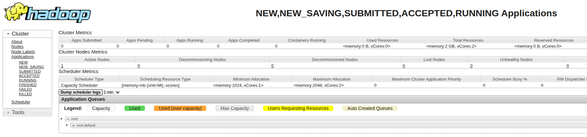
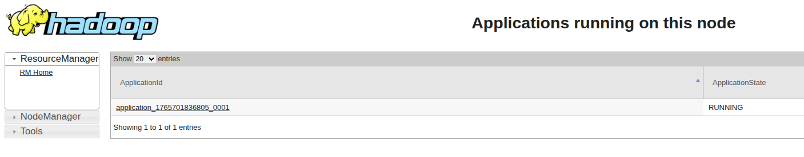

# build
```bash
docker compose build
```

# init
```bash
# ZK + JNs zuerst
docker compose up -d zk1 zk2 zk3 jn1 jn2 jn3

# start primary namenode -> init script format
docker compose up -d --no-recreate nn1

# start secondary namenode -> init script bootstrap
docker compose up -d --no-recreate nn2

# ONLY if timing issues due to slow laptops
docker exec -it nn1 hdfs haadmin -transitionToActive nn1 --forcemanual

# Datanodes und yarn
docker-compose up -d --no-recreate dn1 dn2 dn3 

# Ressource Manager
docker-compose up -d --no-recreate rm 

# Nodemanager runner
docker-compose up -d --no-recreate nm
``

# start after init
```bash
docker compose up -d
```

# web uis
* http://localhost:9870

* http://localhost:9871

* http://localhost:8088

* http://localhost:8042/node/allApplications


# commands
```bash
docker exec -it nn1 hdfs haadmin -getServiceState nn1
docker exec -it nn1 hdfs haadmin -getServiceState nn2
```

# init transfer folder and start transfer
```bash
docker exec nn1 hdfs dfs -ls /

# Create a local file inside the container
docker exec nn1 bash -c 'echo "Hello HDFS" > /tmp/hello.txt'

# Copy it into HDFS
docker exec nn1 hdfs dfs -put /tmp/hello.txt /data/

docker exec nn1 hdfs dfs -ls /

docker exec nn1 hadoop distcp hdfs://oldcluster:8020/data hdfs://ns1/data
```

# run yarn examples
```bash
docker exec rm ls -l /opt/hadoop/share/hadoop/yarn/yarn-service-examples
total 16
drwxr-xr-x 2 1001 1001 4096 Aug 20 11:13 appcatalog
drwxr-xr-x 2 1001 1001 4096 Aug 20 11:13 httpd
drwxr-xr-x 2 1001 1001 4096 Aug 20 11:13 httpd-no-dns
drwxr-xr-x 2 1001 1001 4096 Aug 20 11:13 sleeper

docker exec rm ls -l /opt/hadoop/share/hadoop/mapreduce/
total 5492
-rw-r--r-- 1 1001 1001  592059 Aug 20 10:49 hadoop-mapreduce-client-app-3.4.2.jar
-rw-r--r-- 1 1001 1001  789755 Aug 20 10:49 hadoop-mapreduce-client-common-3.4.2.jar
-rw-r--r-- 1 1001 1001 1843760 Aug 20 10:49 hadoop-mapreduce-client-core-3.4.2.jar
-rw-r--r-- 1 1001 1001  183362 Aug 20 10:49 hadoop-mapreduce-client-hs-3.4.2.jar
-rw-r--r-- 1 1001 1001   10413 Aug 20 10:49 hadoop-mapreduce-client-hs-plugins-3.4.2.jar
-rw-r--r-- 1 1001 1001 1663667 Aug 20 10:49 hadoop-mapreduce-client-jobclient-3.4.2-tests.jar
-rw-r--r-- 1 1001 1001   50253 Aug 20 10:49 hadoop-mapreduce-client-jobclient-3.4.2.jar
-rw-r--r-- 1 1001 1001   90946 Aug 20 10:49 hadoop-mapreduce-client-nativetask-3.4.2.jar
-rw-r--r-- 1 1001 1001   63404 Aug 20 10:49 hadoop-mapreduce-client-shuffle-3.4.2.jar
-rw-r--r-- 1 1001 1001   22851 Aug 20 10:49 hadoop-mapreduce-client-uploader-3.4.2.jar
-rw-r--r-- 1 1001 1001  281633 Aug 20 10:49 hadoop-mapreduce-examples-3.4.2.jar
```

# word count beispiel
```bash
# Datei in HDFS anlegen
docker exec nn1 bash -c 'echo "Hello Hadoop Hello YARN" > /tmp/input.txt'
docker exec nn1 hdfs dfs -mkdir -p /input
docker exec nn1 hdfs dfs -put /tmp/input.txt /input/

# WordCount starten
docker exec rm hadoop jar /opt/hadoop/share/hadoop/mapreduce/hadoop-mapreduce-examples-3.4.2.jar wordcount /input /output

# Ergebnis ansehen
docker exec nn1 hdfs dfs -cat /output/part-r-00000

```

# delete
```bash 
docker compose down -v 
``