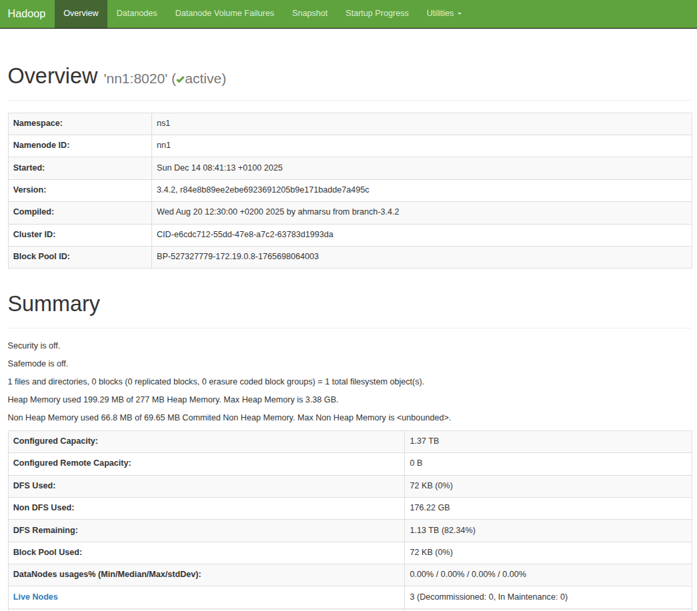
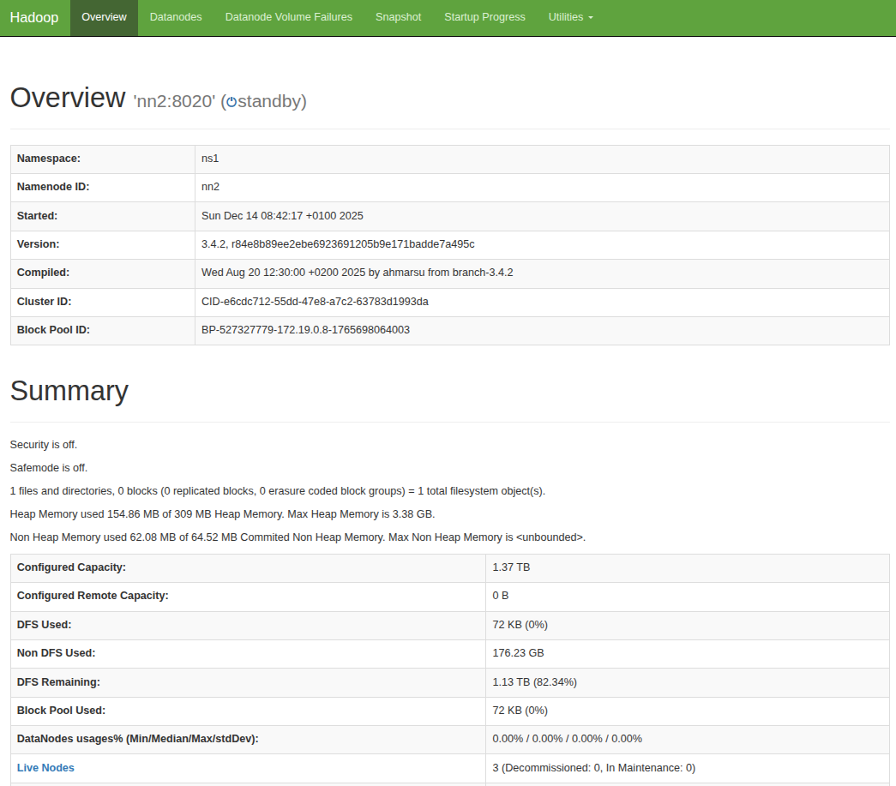

# build
```bash
docker compose build
```

# init
```bash
# ZK + JNs zuerst
docker compose up -d zk1 zk2 zk3 jn1 jn2 jn3

# start primary namenode -> init script format
docker compose up -d --no-recreate nn1

# start secondary namenode -> init script bootstrap
docker compose up -d --no-recreate nn2

# ONLY if timing issues due to slow laptops
docker exec -it nn1 hdfs haadmin -transitionToActive nn1 --forcemanual

# Datanodes und yarn
docker-compose up -d --no-recreate dn1 dn2 dn3 rm nm
``

# start after init
```bash
docker compose up -d
```

# web uis
* http://localhost:9870

* http://localhost:9871


# commands
```bash
docker exec -it nn1 hdfs haadmin -getServiceState nn1
docker exec -it nn1 hdfs haadmin -getServiceState nn2
```

# init transfer folder and start transfer
```bash
docker exec nn1 hdfs dfs -ls /

# Create a local file inside the container
docker exec nn1 bash -c 'echo "Hello HDFS" > /tmp/hello.txt'

# Copy it into HDFS
docker exec nn1 hdfs dfs -put /tmp/hello.txt /data/

docker exec nn1 hdfs dfs -ls /

docker exec nn1 hadoop distcp hdfs://oldcluster:8020/data hdfs://ns1/data
```

# delete
```bash 
docker compose down -v 
``